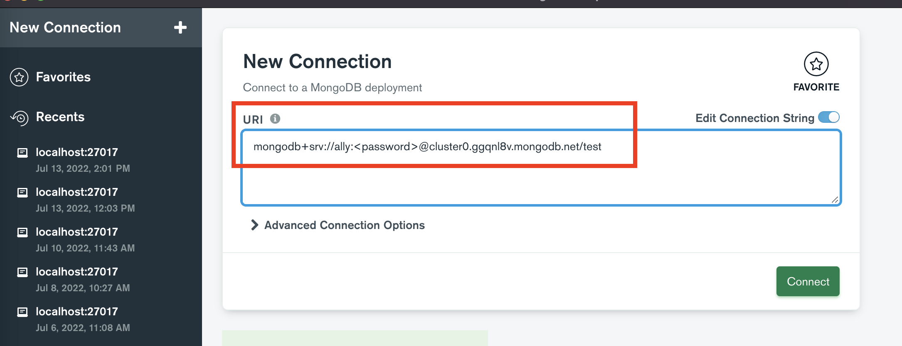
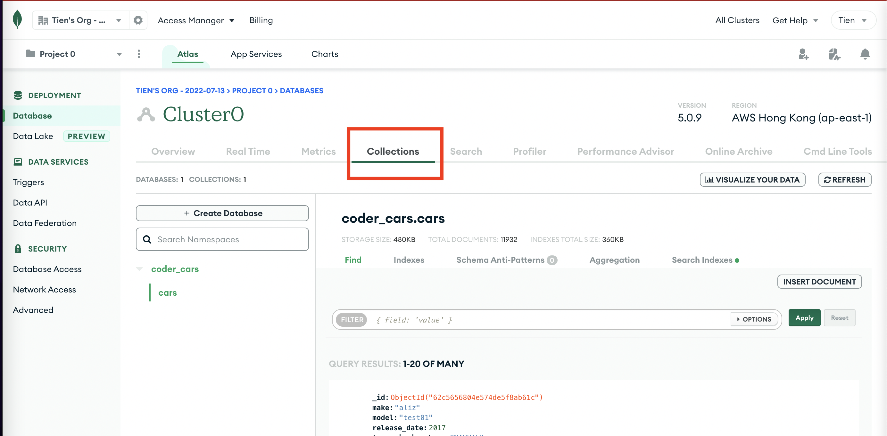

# Deploy to Heroku and Atlas

This guide assume that you have been working on your local mongo database which might have data already. 
In that case, here is the steps to deploy your backend app:

1. Export local data to migrate it to cloud service
2. Create Atlas cloud service account
3. Connect to Atlas with Compass (GUI)
4. Testing Compass and Atlas connection
5. Connect your project to Atlass by editing `.env/MONGO_URI`
6. Create Heroku account
7. Deploy Heroku API app
8. Config Heroku env so that it point to your Atlas cluster for data query
9. Test and success

## I/ Export Local Data

To migrate your local data to Atlas, first we have to export your local data. There are 2 ways to do this : using mongo CLI or using Compass. Let's keep it simple by using the GUI of Compass

1. Click export collection.

 

2. Choose Export Full Collection

 

3. Choose all the data fields you want in your cloud server.

 

4. Continue to export it under the `json` format. Make sure the `json` file name matches your collection name. It is a good practice to follow.

 

## II/ Create Atlas cluster

After signing in [Mongo Atlas](./assets/https://bit.ly/3REpPEX), you will be directed to the below site. From now we will start building a cloud server, and connect it to your local database.

1. Click on Build a Database

 

2. Choose the free option for practicing purposes.

 

3. Select the closest server to Vietnam, in this case - is HongKong.

 

4. You have created a cluster, let's continue to set up your database with `username` and `passsword`. For examples : `username: admin` & `password: admin` 
**Note:** These are important info, that will be used to connect to your cluster. ❗️ Please jot down and memorize it somewhere.

 

5. Scroll down and add Entries - which IP address is authorized to write to your cluster? 
For now, let's follow the instruction and put `0.0.0.0` - which means your cluster can be accessed from everywhere.

 

6. After `Finish and Close` you will be redirected to the Database.

 

7. Your cluster is now ready to connect to the local Compass. Let's get URI. (URI is short for Uniform Resource Identifier )

 

8. Replace `<password>` with your real password and copy the URI.

 

## III/ Connect Atlas server to your local data via Mongo Compass.

With the above steps, you already have a cloud server waiting. From now we will connect your local to the cloud via Mongo Compass.

1. Paste your URI here to make new connection.

 

2. Look at the left corner to check up what server you're connecting to. If it's a cluster, you can now start importing data.

 

3. In tab Database, click on Create database.

 

4. Select your data type, in this case is `json` and Import.

 

5. This is the expected result.

 

## IV/ Checking Atlas and Compass Connection

Now, let's get back to your Atlas!
1. Switch to the **Collections** tab to see imported data

If you see your data then pad yourself in the back.
 

## V/ Deploy to Heroku

1. In your `.env`, connect Atlas server to your backend project.

 

2. Create Heroku account

 

3. Create a new project with this button.

 

4. Connect GitHub and Heroku

 

5. Config Heroku env so that it point to your Atlas cluster for data query. Key: `MONGO_URI`. Value: your atlas Cluster URI.

 

6. Choose the branch 

 

7. Now your app is ready to deploy.

## The end